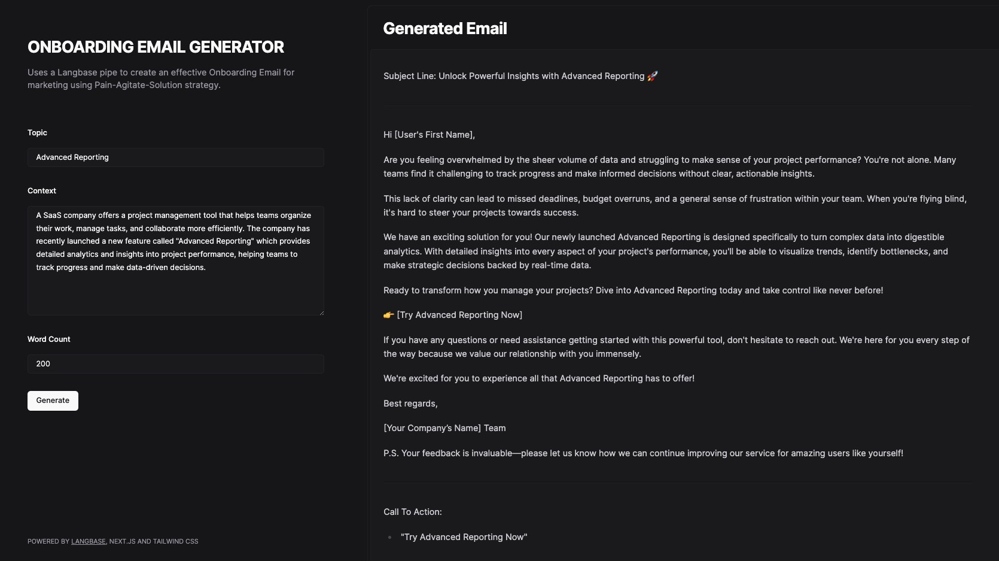

## Onboarding Email Generator

AI Onboarding email generater that helps you creates an effective Onboarding Email for marketing using Pain-Agitate-Solution strategy. The tool uses a Langbase pipe using the Langbase API under the hood.

## How to Use

- Fork the [onboarding email generator pipe](https://beta.langbase.com/acme/marketing-onboarding-email) on langbase. Sign up for free if you haven't already.

- In the forked pipe, navigate to API tab and copy the API key.

- Clone this repository and create a `.env` file in the root directory or see the `.env.example` file.

- Add your Langbase pipe API key to the `.env` file as follows:

```
NEXT_LB_PIPE_API_KEY=YOUR_PIPE_API_KEY
```

- Run the project using the following command:

```bash
npm run dev
```

---

***Powered by [Langbase](https://langbase.com/)***
