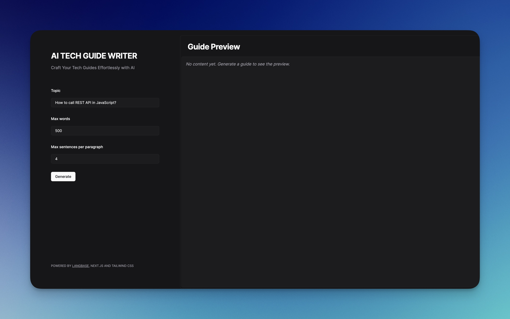

## Tech Guide Writer

A simple LLM API project to help you write technical guides. The tool uses Langbase Pipe API under the hood to integrate 10+ LLM models in the app.

Check out the live demo [here](https://ai-tech-blog-writer.langbase.dev/).

## Features

- Generate a technical guide on any topic
- SEO-optimized content

## Local Development

1. Fork the [tech-blog-writer](https://langbase.com/langbase/tech-blog-writer) Pipe on Langbase.
2. Copy the Pipe's API key.
3. Duplicate the `.env.example` file and rename it to `.env.local`.
4. Add the following environment variables:

```
NEXT_LB_PIPE_API_KEY=YOUR_PIPE_API_KEY
```

Replace `YOUR_PIPE_API_KEY` with the copied API key.

5.  Run the project using the following command:

```bash
npm run dev
```

---

**_Powered by [Langbase](https://langbase.com/)_**
