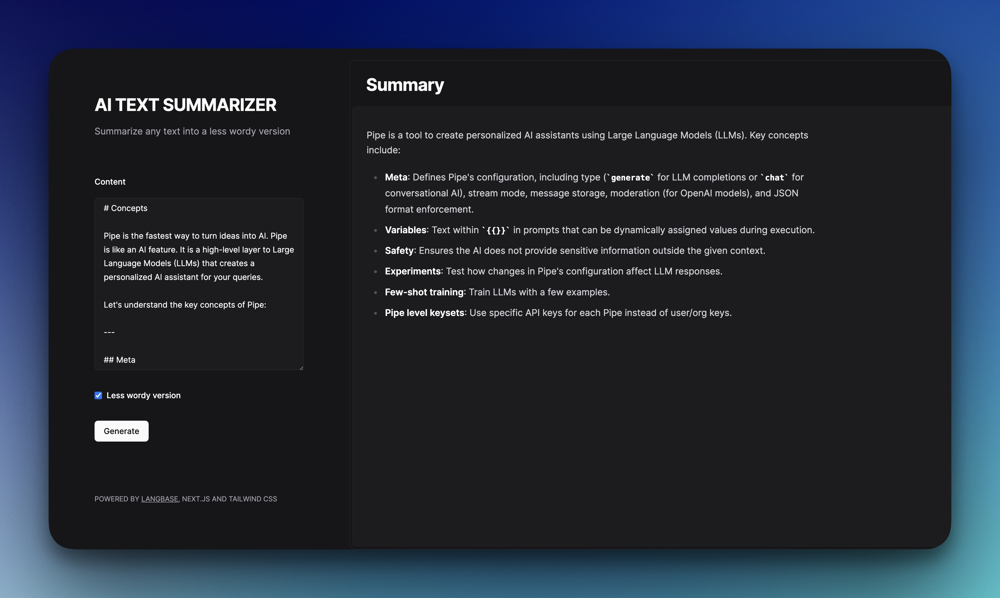

## AI Text Summarizer

A simple AI text summarizer app powered by [Langbase](https://langbase.com/). This tool uses the `gpt-o` model to generate a concise summary of any provided content.

## Local Development

1. Fork the [text-summarizer](https://beta.langbase.com/langbase/text-summarizer) Pipe on Langbase.
2. Copy the Pipe's API key.
3. Duplicate the `.env.example` file and rename it to `.env.local`.
4. Add the following environment variables:

```
NEXT_LB_PIPE_API_KEY=YOUR_PIPE_API_KEY
```

Replace `YOUR_PIPE_API_KEY` with the copied API key.

5.  Run the project using the following command:

```bash
npm run dev
```

---

**_Powered by [Langbase](https://langbase.com/)_**
